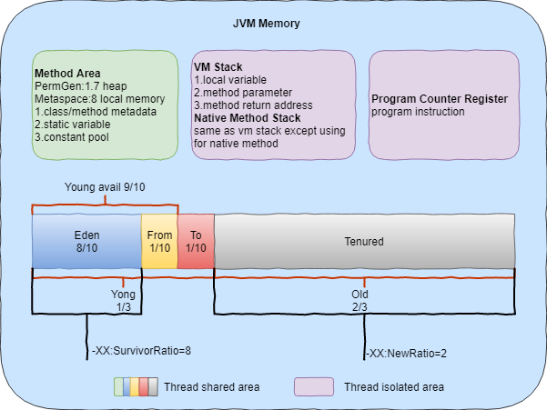
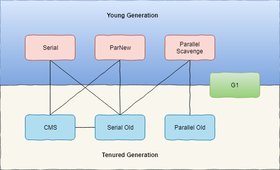

# Dev2 Maintenance Tutorial
- [Dev2 Maintenance Tutorial](#Dev2-Maintenance-Tutorial)
  - [Goal](#Goal)
  - [Commands](#Commands)
    - [CPU](#CPU)
      - [top](#top)
    - [Disk](#Disk)
      - [df](#df)
      - [du](#du)
      - [ls/ll](#lsll)
    - [Network](#Network)
      - [sar](#sar)
    - [IO](#IO)
      - [iostat](#iostat)
    - [Memory](#Memory)
      - [free](#free)
    - [JVM](#JVM)
      - [JVM Memory](#JVM-Memory)
      - [jps](#jps)
      - [jmap](#jmap)
      - [jstat](#jstat)
      - [jstack](#jstack)
      - [jhat](#jhat)
      - [jinfo](#jinfo)
    - [Port](#Port)
      - [netstat](#netstat)
      - [lsof](#lsof)
    - [Dubug](#Dubug)
      - [jdb](#jdb)
  - [Arthas](#Arthas)
## Goal 
- 如何在linux上进行问题分析
- java命令及工具的初步了解和掌握
- 运维流程标准化专业化
## Commands
### CPU
#### top
- Description：top程序提供了运行系统的动态实时视图。它可以显示系统摘要信息以及当前由Linux内核管理的进程或线程列表。
- Synopsis
  - top -hv|-bcHiOSs -d secs -n max -u|U user -p pid -o fld -w [cols]
- Command-line options || Interactive command
  - 1：显示所有cpu信息
  - U|u user：过滤对应的程序
  - M：内存使用率倒序查看
  - P：Cpu使用率倒序查看
  - H：线程显示
  - E：扩展模式显示summary的内存数据
  - e：扩展模式显示task window的内存数据
  - k：kill signal(15, 9) 
  - L：搜索关键字 - &：find next
  - f：添加field, d|space->q|esc
  - p：启动参数，监控对一个的pid进程
- Pay Attention to
  - load average：1min 5min 15min
  - Mem：free+buff+cache, see also free(1)
  - RES：Resident Memory Size，某一个正在运行的进程使用的非交换区的物理内存大小
### Disk
#### df
- Description：report file system disk space usage
- Synposis：df [OPTION]... [FILE]...
- Command line options
  - h：human
  - T：show type
- Pay Attension to：
  - 查询某个目录mount on在哪里？df -h /home/dce
#### du
- Description： estimate file space usage
- Synposis：df [OPTION]... [FILE]...
- Command line options
  - h：human
  - s：summarize
- Pay Attension to：none
#### ls/ll
- h：human 
### Network
#### sar
- Description： Collect, report, or save system activity information
- Synposis：man sar
- Command line options
  - d：report activity for each block device, see also iostat
  - n：report network statistics
- Pratice
  - wget https://github.com/apache/flink/archive/release-1.8.1-rc1.tar.gz
  - sar -n DEV 2
### IO
#### iostat
- Description：Report Central Processing Unit (CPU) statistics and input/output statistics for devices and partitions 
- Synposis：man iostat
- Command line options
  - h：human
  - p：displays statistics for block devices
  - x：display extended statistics
  - m：megabyte
- Pratice
  - dd if=/dev/zero of=test bs=1k count=1024000
  - fio -filename=./test -direct=1 -iodepth 1 -rw=randwrite -ioengine=libaio -bs=16k -size=2G -numjobs=1 -runtime=60 -group_reporting -name=mytest
  - iostat -p -h -x 1
- Pay attension to
  - avgqu-sz：发送到设备上的io请求的平均队列长度
  - r_await：设备可以处理读请求的平均时间（毫秒）
  - w_await：设备可以处理写请求的平均时间（毫秒）
  - %util：Percentage of elapsed time during which I/O requests were issued to the device (bandwidth utilization for the  device). Device saturation occurs when this value is close to 100%
### Memory
#### free
- Description：Display amount of free and used memory in the system
- Synposis：free [OPTION]
- Command line options
  - h：human
- Pay Attension to：
  - remain = free+buff/cache
### JVM
#### JVM Memory
- JVM Memory Anatomy

- JVM Memory Management
  - Eden
  - Survivor
    - from
    - to
  - Tenured
  - Metaspace
- GC Collection

  |        Parameter        |          Description           |
  | :---------------------: | :----------------------------: |
  |    -XX:+UseSerialGC     |       Serial+Serial Old        |
  |    -XX:+UseParNewGC     |       ParNew+Serial Old        |
  | -XX:+UseConcMarkSweepGC |  ParNew+CMS Serial Old backup  |
  |   -XX:+UseParallelGC    |  Parallel Scavenge+Serial Old  |
  | -XX:+UseParalledlOldGC  | Parallel Scavenge+Parallel Old |
  |      -XX:+UseG1GC       |         java1.7 java8          |
- JVM Memory Parameter
  - -X：非所有JVM支持
  - -XX：非稳定选项

  |            Parameter            |        Description         |
  | :-----------------------------: | :------------------------: |
  |              -Xmx               |       max heap space       |
  |              -Xms               |       min heap space       |
  |              -Xmn               |        young space         |
  |              -Xss               |        stack space         |
  |           -verbose:gc           |        print gc log        |
  |       -XX:+PrintGCDetails       |    print detail gc log     |
  |       -XX:+PrintHeapAtGC        | print gc log when gc occur |
  |       -Xloggc:log/gc.log        |      config log path       |
  | -XX:+HeapDumpOnOutOfMemoryError | create dump file when oom  |
  |     -XX:+HeapDumpPath=XXXX      |   config dump file path    |
- Java Type Information 

  |       Alias        |   Type    |
  | :----------------: | :-------: |
  |         B          |   Byte    |
  |         C          |   Char    |
  |         D          |  Double   |
  |         F          |   Float   |
  |         I          |  Integer  |
  |         J          |   Long    |
  |         Z          |  Boolean  |
  |         S          |   Short   |
  |         [I         | Integer[] |
  | Ljava/lang/String; |  String   |
#### jps
- Description：Lists the instrumented Java Virtual Machines (JVMs) on the target system
- Synposis：jps [ options ] [ hostid ]
- Command line
  - m：显示main函数的参数
- Pay attention to：none
#### jmap
- Description：Prints shared object memory maps or heap memory details for a process, core file, or remote debug server
- Synposis：jmap [ options ] pid
- Command line
  - heap：显示堆内存的垃圾回收信息
  - histo[:live]：堆的直方图
  - dump：输出dump文件，可以被jhat使用
- Practice
  - jmap -histo pid
  - jmap -heap pid
  - jmap -dump:format=b,file=\<out\> pid
- Pay attention to：none
  - java8之后取消永久代，增加Metaspace区域
  - java9之后默认的GC为G1
#### jstat
#### jstack
#### jhat
#### jinfo
- Description：generates configuration information
- Synposis：jinfo [ option ] pid
- Command line：none
- Pay attention to：none
- Pratice
  - jinfo pid | grep version
  - jinfo pid | grep "VM flags"
### Port
#### netstat
- Command line
  - t：tcp
  - u：udp
  - n：show number
  - l：show listend
  - p：show related program name
- Practice
  - netstat -tunlp | grep port
#### lsof
- Practice
  - lsof -i:port
### Dubug
#### jdb
## Arthas